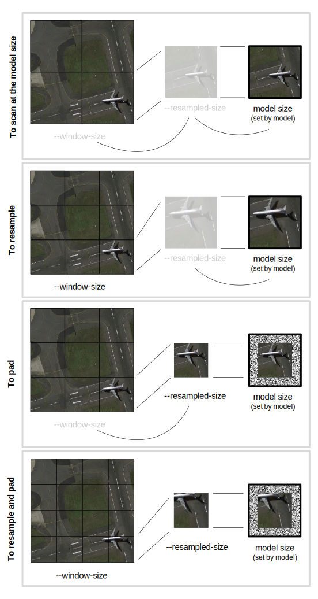

# OpenSpaceNet User Reference Guide

_OpenSpaceNet_ application to perform object or terrain detection against georegistered imagery using the DeepCore libraries.
This application includes and is based on CUDA 8.0 and requires NVIDIA driver version 384 or higher to run using the GPU.

## Table Of Contents

* [Command Line Arguments](#arguments)
  * [Local Image Input Options](#image)
  * [Web Service Input Options](#service)
  * [Output Options](#output)
  * [Processing Options](#processing)
  * [Segmentation Options](#segmentation)
  * [Filtering Options](#filter)
  * [Logging Options](#logging)
* [Further Details](#details)
  * [Image Input](#input)
  * [Size Parameters](#size)
  * [Using Configuration Files](#config)
  * [S3 Input Files](#s3)
  * [Usage Statement](#usage)

<a name="arguments" />

## Command Line Arguments

<a name="detect" />

### Feature Detection Options

##### --confidence
This option sets the minimum percent score for results to be included in the output. This should be a value between 0 and 100. 
The default value for this argument is 95%.

i.e. `--confidence 99` sets the confidence to 99%.

##### --nms
This option will cause _OpenSpaceNet_ to perform non-maximum suppression on the output. Adjacent detection boxes
will be removed for each feature detected and only one detection box per object will be output. This option results in much
better quality output. You can optionally specify the overlap threshold percentage for non-maximum suppression calculation.
The default overlap is 30%.
i.e. `--nms` will result in non-maximum suppression with 30% overlap, while `--nms 20` will result in non-maximum 
suppression with 20% overlap.

<a name="image" />

### Local Image Input Options

##### --image

This argument is required for local image input and specifies the path to the image.  For the advanced user, GDAL syntax
may be used to load files from URLs or S3 buckets (see below for instructions on how to load imagery from S3).

i.e. `--image /home/user/Pictures/my_image.tif`

##### --bbox

The bounding box argument is optional for local image input. If the specified bounding box is not fully within the input
image an intersection of the image bounding box and the specified bounding box will be used. If the specified bounding
box does not intersect the image, an error will be displayed.

<a name="service" />

### Web Service Input Options

##### --service

This argument is required for a web service input. If this argument is specified, the `--image` argument cannot be 
present. The following services are available:

* 'dgcs' is the DigitalGlobe Cloud Services WMTS data source. This service requires both `--token` and `--credentials` to 
be set. The service's Web URL is http://services.digitalglobe.com/.
 
* 'evwhs' is the DigitalGlobe Enhanced View Web Hosting Service WMTS data source. This service requires both `--token` 
and `--credentials` to be set. The service's web URL is http://evwhs.digitalglobe.com/.

* 'maps-api' is the DigitalGlobe's MapsAPI service hosted by MapBox. This service only requires the `--token` to be set.
In addition, the user can specify the `--map-id` argument to set the image source map ID. The service's web URL is 
http://mapsapi.digitalglobe.com/.

* 'tile-json' is a format by MapBox for describing collections of tiles. This service requires both `--url` and accepts
`--credentials` (for URL that require them). The format specification is available at https://github.com/mapbox/tilejson-spec.

##### --bbox

The bounding box argument is required for all web service input sources. The coordinates are specified in the WGS84 
Lat/Lon coordinate system. The order of coordinates is west longitude, south latitude, east longitude, and north latitude.
Note that for the landcover action the bounding box may be expanded so that the tiles downloaded from the service will
be processed completely.

i.e. `--bbox 125.541 38.866 125.562 38.881` specifies a bounding box for the Atlanta Hartsfield-Jackson Airport area.

##### --token

This argument specifies the API token for the desired web service. This is required for WMTS and MapsAPI services.

##### --credentials

This argument specifies the user name and password for the WMTS services, that is `dgcs` and `evwhs`. The format is
`--credentials username:password`. If only the user name is specified like `--credentials username`, the user will be
prompted for the password before _OpenSpaceNet_ will proceed. In addition, credentials can be specified by setting the
`OSN_CREDENTIALS` environment variable.

##### --url

TileJSON server URL. TileJSON server URL. This is only required for the tile-json service.

TileJSON server URL should either directly point to the to the JSON definition of the
TileJSON server, or if the JSON definition's file name matches the root tile directory
name, we can just specify the root tile directory name. 

i.e. if the server
URL is `https://my.server.com/tiles`, then _OpenSpaceNet_ will look for
`https://my.server.com/tiles.json`.

_OpenSpaceNet_ also supports reading tilesets locally. To do this, just specify
a `file://` URL. 

i.e.

If I have the following file structure:

* /data/
 * tiles.json
 * tiles/
  * 14/
   * 4348/
    * 6564.jpg
   * 4349/
    * 6564.jpg
   * 4350/
    * 6564.jpg

I can specify it as `file:///data/tiles`. 

##### --use-tiles

If set, the "tiles" field in TileJSON metadata will be used as the tile service 
address. The default behavior is to derive the service address from the provided URL.


##### --zoom

This argument specifies the zoom level for the web service. For MapsAPI the zoom level is 0 to 22, while both DGCS and
EVWHS zoom levels range from 0 to 20. The default zoom level is 18.

##### --map-id

This argument is only valid for the MapsAPI, or `maps-api` service. The DigitalGlobe map IDs are listed on this web page:
http://mapsapidocs.digitalglobe.com/docs/imagery-and-basemaps.

##### --max-connections

This argument specifies the number of image tiles that will be downloaded simultaneously. Increasing the value of this
argument can dramatically speed up downloads, but it can cause the service to crash or deny you access. The default value
is 10.

<a name="output" />

### Output Options

##### --format

This option specifies the output vector format. The default format is `shp`. 
The following formats are supported:

* `csv` outputs to a CSV file.
* `elasticsearch` writes the output to an Elastic Search database.
* `geojson` outputs a GeoJSON file.
* `kml` outputs a Google's Keyhole Markup Language format.
* `postgis` writes the output to a Postgres SQL database with PostGIS extensions.
* `shp` for ESRI Shapefile output. For this format, `--output-layer` is ignored.
* `sqlite` writes the output to a SpatialLite SQLite database.

##### --output

This option specifies the output path or connection settings on non-file output formats. See the GDAL documentation
for information on how to specify non-file formats (http://www.gdal.org/ogr_formats.html).  Only the formats listed
above are supported.

##### --output-layer

This option specifies the output layer name if the output format supports it. 
This option is ignored for `shp` output.

##### --type

This option specifies the output geometry type. The supported types are:

* `polygon` draws a polygon around each detected feature.
* `point` draws a point in the centroid of each detected feature polygon.

##### --producer-info

This option adds additional attributes to each vector feature, the attributes are:

* `username` is the login user name on the machine that ran that _OpenSpaceNet_ job.
* `app` is the name of the application, this is set to "OpenSpaceNet".
* `version` is the application version, which is the _OpenSpaceNet_ version.


##### --dgcs-catalog-id

Add `catalog_id` property to detected features by finding the most intersected 
`legacyId` from DGCS WFS data source `DigitalGlobe:FinishedFeature`.
                                        
##### --evwhs-catalog-id

Add `catalog_id` property to detected features by finding the most intersected 
`legacyId` from EVWHS WFS data source `DigitalGlobe:FinishedFeature`.

##### --wfs-credentials

Specifies credentials for the WFS service, if appending legacyId. The format is
`--wfs-credentials username:password`. If not specified, credentials from the 
`--credentials` option will be used.

##### --append
This option will cause _OpenSpaceNet_ to append to the specified output. If the 
specified output is not found, it will be created. If this option is not 
specified and the output already exists, it will be overwritten.

<a name="processing" />

### Processing Options

Processing options contain the classifier configuration options that are common 
for both landcover and detect modes.

##### --cpu

Specifying this option causes _OpenSpaceNet_ to use the fall-back CPU mode. This 
can be used on machines that don't have the supported GPU, but it is 
dramatically slower, so it's not recommended. It is recommended that a GPU be 
used to do CNN feature detection efficiently.

##### --max-utilization

This option specifies how much GPU memory _OpenSpaceNet_ will try to use. The 
default value is 95%, which empirically shown to yield best performance. As 
utilization approaches 100%, it slows down drastically, so 95% is the 
recommended maximum. The valid values are between 5% and 100%. Values outside of 
this range will be clamped, and a warning will be shown.

##### --model

This option specifies the path to a package GBDXM model file to use in processing.

##### --window-size

This option sets the size of the window that is chipped from the source imagery.  
If multiple arguments are supplied, windows for each size are extracted in turn.  
Each window that is extracted will have the aspect ratio of the model and the 
width that is specified.

If one window size and move than one window step is given, it is used for every 
window step.  If more than one window size and more than one window step is 
specified, the number of window sizes must match the number of window steps.

Unless `--resample-size` is supplied, each window size must be equal to or 
smaller than the model's size.  If it is smaller, the chipped image will be 
padded with uniformly distributed white noise.  The range of the noise is 
dependent on the image's datatype (specifically, 0 to 1 for floating point 
datatypes and the full representable range for integer datatypes).

##### --window-step

This option sets the sliding window step. The default value is 20% of the 
model's size.  Each window step will have the aspect ratio of the model and the 
_x_ step that is specified.

If one window step and move than one window size is given, it is used for every 
window step.  If more than one window size and more than one window step is 
specified, the number of window sizes must match the number of window steps.

i.e. `--window-step 30` will result in the sliding window step being 30 in the 
_x_ direction and 30 in the _y_ direction.

##### --resampled-size

This option resampled all chipped windows to a single size.  The resampled 
images will have the aspect ratio of the model and the width that is specified.

If given, the resampled size must be equal to or smaller than the model's size. 
If it is smaller, the chipped image will be padded with uniformly distributed 
white noise.  The range of the noise is dependent on the image's datatype 
(specifically, 0 to 1 for floating point datatypes and the full representable 
range for integer datatypes).

##### --pyramid

This option will enable using pyramids in feature detection. This means that the 
image will be repeatedly resampled down by a factor of 2 with sliding window 
detection run on each reduced image. This option will result in much longer run 
time and is not recommended. Most _OpenSpaceNet_ models are designed to work at 
a certain resolution and do not benefit from pyramiding.`

When this is given, `--window-size` and `--window-step` arguments may be 
specified, but only the first option for each will be used.

<a name="segmentation" />

### Segmentation Options

Segmentation options contain options for raster-to-polygon conversion for
segmentation models. These are not mandatory and are only applicable to
segmentation models. If set for a different model type, a warning will be 
displayed.

##### --r2p-method METHOD
This is the raster-to-polygon approximation method.
Valid values are: `none`, `simple`, `tc89-l1`, `tc89-kcos`. The default value
is `simple`.

The methods are as follows:

* `none`: Stores absolutely all the contour points. That is, any 2 subsequent 
points _(x<sub>1</sub>,y<sub>1</sub>)_ and _(x<sub>2</sub>,y<sub>2</sub>)_ of 
the contour will be either horizontal, vertical or diagonal neighbors, that is, 
<em>max(|x<sub>1</sub> - x<sub>2</sub>|, |y<sub>2</sub>-y<sub>1</sub>|) = 1</em>.

* `simple`: Compresses horizontal, vertical, and diagonal segments and leaves 
only their end points. For example, an up-right rectangular contour is encoded 
with 4 points.

* `tc89-l1`:  Applies the <em>1 curvature</em> Teh-Chin chain approximation 
algorithm.

* `tc89-kcos`: Applies the <em>k cosine</em> Teh-Chin chain approximation 
algorithm.


The Teh-Chin approximations are as described in:

> Teh, C-H and Chin, Roland T. <b>On the detection of dominant points on digital curves.</b> <br/> 
> IEEE Transactions on Pattern Analysis and Machine Intelligence, 1989, vol. 11, num. 8, pp. 859-872 

##### --r2p-accuracy

This argument specifies the polygon approximation accuracy. This is the maximum 
distance between the original curve and its approximation. The default value is 3.


##### --r2p-min-area

This argument sets the minimum area of a polygon in pixels. The default value
is 0.

<a name="filter" />

### Filtering Options

##### --include-labels / --exclude-labels

This option will cause _OpenSpaceNet_ to retain or remove labels in the output.  It is invalid to include both an
inclusion and an exclusion list at the same time.

When specified in an environmental variable or configuration file, the input string will be tokenized.  Quotes are
required to keep label names with spaces together.

##### --include-region / --exclude-region / --region

These options will cause _OpenSpaceNet_ to skip processing any windows which touch the excluded region.

By default, no regions are excluded.  If any of these options are given, a filter is built.  If the
first action is "exclude", the filter is initialized to include the bounding box.

`--exclude-region` will subtract geometries contained within the supplied path(s) to the from the search region.

`--include-region` will add the geometries contained within the supplied path(s) from the search region.

`--region` can be used to chain together multiple includes and excludes.  Parameters to this option are in the
form `(exclude|include) path [path..]`  This may be repeated any number of times after `--region`.


i.e `--region exclude northwest.shp northeast.shp include truenorth.shp` .  In this example, "exclude" is first,
so the search region is initialized to the bounding box.  The geometries defined in northwest.shp and northeast.shp
are excluded (through geometric union). The geometry in truenorth.shp added back.  This way of specifying a region
filter is exactly the same as  `--exclude-region northwest.shp northeast.shp --include-region truenorth.shp`.


<a name="logging" />

### Logging Options

##### --log

This option specifies a log file that _OpenSpaceNet_ writes to. Optionally, a log level can be specified. Permitted
log level values are `trace`, `debug`, `info`, `warning`, `error`, and `fatal`. The default log level is `debug`.

When specified in an environmental variable or configuration file, the input string will be tokenized.  Quotes are
required to keep inputs with spaces together.

Only one log file may only be specified.

i.e. 
`--log log.txt` will create a log file with the log level of `info`
`--log debug log.txt` will create a log file with the log level of `debug`

##### --quiet

Normally `_OpenSpaceNet_` will output its status to the console even if a log file is specified. If
this is not desired, console output can be suppressed by specifying this option.

<a name="details" />

## Further Details


<a name="input" />

### Image Input

_OpenSpaceNet_ is able use either a geo-registered local image or one of number of web maping servcies as input. Depending on the 
input source, different command line arguments apply. To select which source to use, one of two options must be present:

* `--service <service name>` To load imagery from a web service.
* `--image <path>` To load a local image file.

Depending on which source you use, different arguments apply.

| source                | token    | credentials | map-id   | zoom     | bbox     | max-connections | url      | use-tiles |
|-----------------------|----------|-------------|----------|----------|----------|-----------------|----------|-----------|
| `--service dgcs`      | Required | Required    |          | Optional | Required | Optional        |          |           |
| `--service evwhs`     | Required | Required    |          | Optional | Required | Optional        |          |           |
| `--service maps-api`  | Required |             | Optional | Optional | Required | Optional        |          |           |
| `--service tile-json` |          | Optional    |          | Optional | Required | Optional        | Required | Optional  |
| `--image <path>`      |          |             |          |          | Optional |                 |          |           |

<a name="size" />

## Size Parameters

Some models may require that the imagery be resized or padded to fit the target 
model.  When performing these actions, use `--resampled-size` and `--window-size` 
to add padding and resizing, respectively.  See the image below for guidance.




<a name="config" />

### Using Configuration Files

When using _OpenSpaceNet_, some or all command line arguments can be put in configuration file(s) and passed through the `--config` command
line option.  Multiple files may be used to specify different options.

#### Configuration File Syntax

Configuration files are text files with each command line option specified in the following format:
```
name1=value1
name2=value2
```

Option names are the same as the regular command line options without the preceding dashes. The action argument can be
specified in a configuration file by using the following syntax:
```
action=<action>
```

The `--nms` argument is different when using a configuration file in that the overlap percentage is not optional, this means that this
statement is the same as just specifying `--nms` on the command line:
```
nms=30
```

If you try to specify ~~`nms`~~ or ~~`nms=`~~ an error will be displayed.

If a configuration file contains an option that is also specified through a command line parameter, the command line parameter takes
precedence. If multiple configuration files contain the same option, the option in the file specified last will be used.

When specified in an environmental variable or configuration file, the input string will be tokenized.  Quotes are
required to keep inputs with spaces together.

Configuration files may be included in the command line, environment, and other configuration files (and multiple times
within each).


#### Example Using a Configuration File for All Options

In this example, we will use the following file:

**dgcs_detect_atl.cfg**
```ini
action=detect
service=dgcs
token=abcd-efgh-ijkl-mnop-qrst-uvxyz
credentials=username:password
bbox=-84.44579 33.63404 -84.40601 33.64853
model=airliner.gbdxm
output=atl_detected.shp
confidence=99
window-step=15
max-connections=200
nms=30
```

Running _OpenSpaceNet_ with this file
```
./OpenSpaceNet --config dgcs_detect_atl.cfg
```

is the same as running _OpenSpaceNet_ with these options:
```
./OpenSpaceNet detect --service dgcs --token abcd-efgh-ijkl-mnop-qrst-uvxyz --credentials username:password --bbox -84.44579 33.63404 -84.40601 33.64853 --model airliner.gbdxm --output atl_detected.shp --confidence 99 --window-step 15 --max-connections 200 --nms
```
#### Example Using Multiple Configuration Files

As a use case for using multiple files, we'll use the fact that because _OpenSpaceNet_ can use different input sources for its input,
it can be cumbersome to enter that particular service's token and credentials every time.  We can create a configuration file with a
service's credentials and use it with another configuration file that configures detection parameters.

Let's use this file for configuring DGCS credentials:

**dgcs.cfg**
```ini
service=dgcs
token=abcd-efgh-ijkl-mnop-qrst-uvxyz
credentials=username:password
max-connections=200
```

and this file for detection options:

**detect_atl.cfg**
```ini
action=detect
service=dgcs
token=abcd-efgh-ijkl-mnop-qrst-uvxyz
credentials=username:password
bbox=-84.44579 33.63404 -84.40601 33.64853
model=airliner.gbdxm
output=atl_detected.shp
confidence=99
window-step=15
nms=30
```

We can now combine the two files and get the same result as our previous example, but with the flexibility of reusing our credentials file for other jobs:

```
./OpenSpaceNet --config dgcs.cfg detect_atl.cfg
```

#### Example Using a Configuration File Combined with Command Line Options

Alternatively, we can use the configuration file from previous example to run a landcover job against the same DGCS account:

```
./OpenSpaceNet landcover --config dgcs.cfg --bbox -84.44579 33.63404 -84.40601 33.64853 --model landcover.gbdxm --output atl_detected.shp
```

<a name="s3" />

### Files on S3 (a variant of local files)

Since _OpenSpaceNet_ uses GDAL to load local imagery, VSI sources are supported out of the box.  Of 
particular interest is imagery stored on S3.

i.e.

```
AWS_ACCESS_KEY_ID=[AWS_ACCESS_KEY_ID] AWS_SECRET_ACCESS_KEY=[AWS_SECRET_ACCESS_KEY] \
   ./OpenSpaceNet --image /vsis3/bucket/path/to/image.tif --model /path/to/model.gbdxm \
   --output foo.shp
```

#### VSI S3 Parameters
 * `AWS_SECRET_ACCESS_KEY`, `AWS_ACCESS_KEY_ID` (Required) define the access credentials
 * `AWS_SESSION_TOKEN` (Required for temporary credentials)
 * `AWS_REGION` (defaults to 'us-east-1')
 * `AWS_S3_ENDPOINT` (defaults to 's3.amazonaws.com')

#### Additional HTTP Parameters
 * `GDAL_HTTP_PROXY`, `GDAL_HTTP_PROXYUSERPWD`, `GDAL_PROXY_AUTH` configuration options can be used to define a proxy server.

<a name="usage" />

### Usage Statement

This is the usage statement as it appears on the command line.

```text
Radiant Solutions
   ____                    _____                      _   _      _          
  / __ \                  / ____|                    | \ | |    | |         
 | |  | |_ __   ___ _ __ | (___  _ __   __ _  ___ ___|  \| | ___| |_        
 | |  | | '_ \ / _ \ '_ \ \___ \| '_ \ / _` |/ __/ _ \ . ` |/ _ \ __|       
 | |__| | |_) |  __/ | | |____) | |_) | (_| | (_|  __/ |\  |  __/ |_ _ _ _  
  \____/| .__/ \___|_| |_|_____/| .__/ \__,_|\___\___|_| \_|\___|\__(_|_|_) 
        | |                     | |                                         
        |_|                     |_|                                         

Version: 1.1.0+SNAPSHOT
DeepCore Version: 1.1.0+SNAPSHOT
GBDXM Metadata Version: 3.0

Usage:
  OpenSpaceNet <options>
  OpenSpaceNet --config <configuration file> [other options]


Feature Detection Options:
  --confidence PERCENT (=95)            Minimum percent score for results to be
                                        included in the output.
  --nms PERCENT (=30)                   Perform non-maximum suppression on the 
                                        output. You can optionally specify the 
                                        overlap threshold percentage for 
                                        non-maximum suppression calculation.

Local Image Input Options:
  --image PATH                          If this is specified, the input will be
                                        taken from a local image.
  --bbox WEST SOUTH EAST NORTH          Optional bounding box for image subset,
                                        optional for local images. Coordinates 
                                        are specified in the following order: 
                                        west longitude, south latitude, east 
                                        longitude, and north latitude.

Web Service Input Options:
  --service SERVICE                     Web service that will be the source of 
                                        input. Valid values are: dgcs, evwhs, 
                                        maps-api, and tile-json.
  --token TOKEN                         API token used for licensing. This is 
                                        the connectId for WMTS services or the 
                                        API key for the Web Maps API.
  --credentials USERNAME[:PASSWORD]     Credentials for the map service. Not 
                                        required for Web Maps API, optional for
                                        TileJSON. If password is not specified,
                                        you will be prompted to enter it. The 
                                        credentials can also be set by setting 
                                        the OSN_CREDENTIALS environment 
                                        variable.
  --url URL                             TileJSON server URL. This is only 
                                        required for the tile-json service.
  --use-tiles                           If set, the "tiles" field in TileJSON 
                                        metadata will be used as the tile 
                                        service address. The default behavioris
                                        to derive the service address from the 
                                        provided URL.
  --zoom ZOOM (=18)                     Zoom level.
  --map-id MAPID (=digitalglobe.nal0g75k)
                                        MapsAPI map id to use.
  --max-connections NUM (=10)           Used to speed up downloads by allowing 
                                        multiple concurrent downloads to happen
                                        at once.
  --bbox WEST SOUTH EAST NORTH          Bounding box for determining tiles 
                                        specified in WGS84 Lat/Lon coordinate 
                                        system. Coordinates are specified in 
                                        the following order: west longitude, 
                                        south latitude, east longitude, and 
                                        north latitude.

Output Options:
  --format FORMAT (=shp)                Output file format for the results. 
                                        Valid values are: csv, elasticsearch, 
                                        geojson, kml, postgis, shp, sqlite.
  --output PATH                         Output location with file name and path
                                        or URL.
  --output-layer NAME (=osndetects)     The output layer name, index name, or 
                                        table name.
  --type TYPE (=polygon)                Output geometry type.  Currently only 
                                        point and polygon are valid.
  --producer-info                       Add user name, application name, and 
                                        application version to the output 
                                        feature set.
  --dgcs-catalog-id                     Add catalog_id property to detected 
                                        features, by finding the most 
                                        intersected legacyId from DGCS WFS data
                                        source DigitalGlobe:FinishedFeature
  --evwhs-catalog-id                    Add catalog_id property to detected 
                                        features, by finding the most 
                                        intersected legacyId from EVWHS WFS 
                                        data source DigitalGlobe:FinishedFeatur
                                        e
  --wfs-credentials USERNAME[:PASSWORD] Credentials for the WFS service, if 
                                        appending legacyId. If not specified, 
                                        credentials from the credentials option
                                        will be used.
  --append                              Append to an existing vector set. If 
                                        the output does not exist, it will be 
                                        created.

Processing Options:
  --cpu                                 Use the CPU for processing, the default
                                        is to use the GPU.
  --max-utilization PERCENT (=95)       Maximum GPU utilization %. Minimum is 
                                        5, and maximum is 100. Not used if 
                                        processing on CPU
  --model PATH                          Path to the the trained model.
  --window-size SIZE [SIZE...]          Sliding window detection box sizes.  
                                        The source image is chipped with boxes 
                                        of the given sizes.  If resampled-size 
                                        is not specified, all windows must fit 
                                        within the model.Default is the model 
                                        size.
  --window-step STEP [STEP...]          Sliding window step.  Either a single 
                                        step or a step for each window size may
                                        be given.  Default is 20% of the model 
                                        size.
  --resampled-size SIZE                 Resample window chips to a fixed size. 
                                        This must fit within the model.
  --pyramid                             Calculate window parameters.  If this 
                                        is set, only the first window size and 
                                        window step are used.  A family of each
                                        are created by doubling the supplied 
                                        parameters up to the area of the 
                                        detection box.
  --max-cache-size SIZE                 Maximum raster cache size. This can be 
                                        specified as a memory amount, e.g. 16G,
                                        or as a percentage, e.g. 50%. 
                                        Specifying 0 turns off raster cache 
                                        size limiting. The default is 25% of 
                                        the total physical RAM.

Segmentation Options:
  --r2p-method METHOD (=simple)         Raster-to-polygon approximation method.
                                        Valid values are: none, simple, 
                                        tc89-l1, tc89-kcos.
  --r2p-accuracy EPSILON (=3)           Approximation accuracy for the 
                                        raster-to-polygon operation.
  --r2p-min-area AREA (=0)              Minimum polygon area (in pixels).

Filtering Options:
  --include-labels LABEL [LABEL...]     Filter results to only include 
                                        specified labels.
  --exclude-labels LABEL [LABEL...]     Filter results to exclude specified 
                                        labels.
  --include-region PATH [PATH...]       Path to a file prescribing regions to 
                                        include when filtering.
  --exclude-region PATH [PATH...]       Path to a file prescribing regions to 
                                        exclude when filtering.
  --region (include/exclude) PATH [PATH...] [(include/exclude) PATH [PATH...]...]
                                        Paths to files including and excluding 
                                        regions.

Logging Options:
  --log [LEVEL (=debug)] PATH           Log to a file, a file name preceded by 
                                        an optional log level must be 
                                        specified. Permitted values for log 
                                        level are: trace, debug, info, warning,
                                        error, fatal.
  --quiet                               If set, no output will be sent to 
                                        console, only a log file, if specified.

General Options:
  --config PATH                         Use options from a configuration file.
  --help                                Show this help message
```
